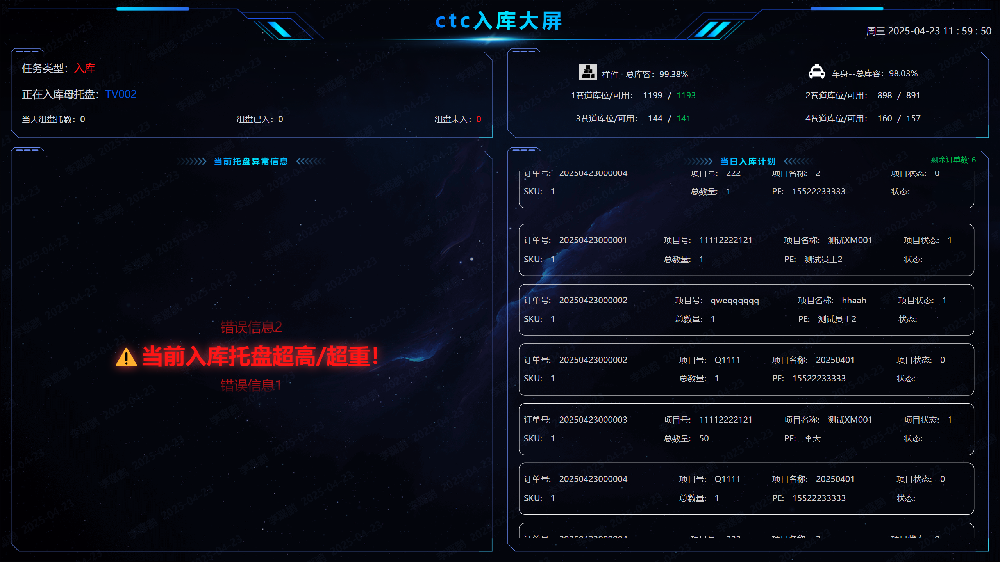
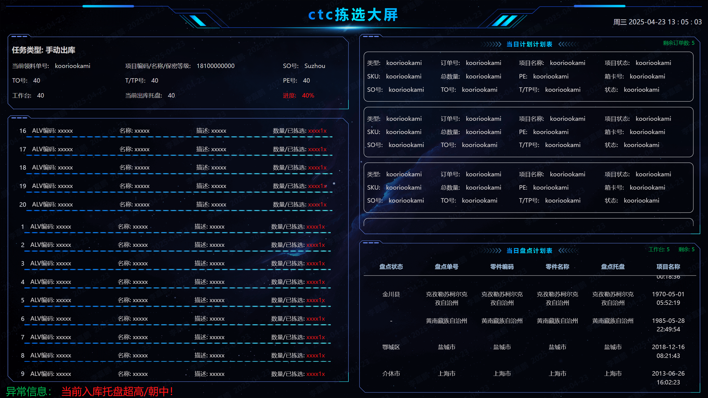
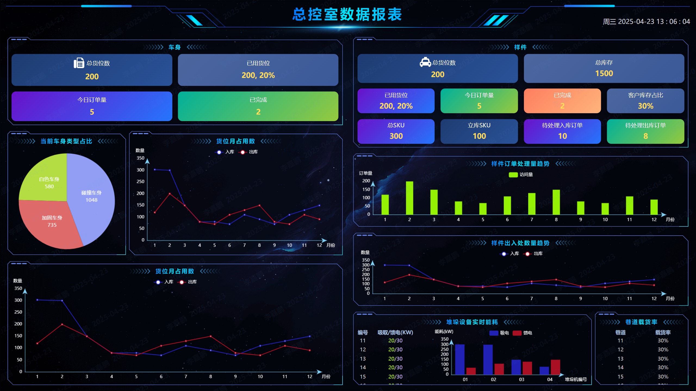

# 简介
 vue3 + vite 大屏项目模板，页面尺寸自适

# 项目预览地址
[https://screen-vue3-apr8.vercel.app/#/storage](https://screen-vue3-apr8.vercel.app/#/storage)
[https://screen-vue3-apr8.vercel.app/#/picking](https://screen-vue3-apr8.vercel.app/#/picking)
[https://screen-vue3-apr8.vercel.app/#/mainControlRoom](https://screen-vue3-apr8.vercel.app/#/mainControlRoom)
页面地址打不开，请科学上网






## Project Setup

```sh
npm install
```

### Compile and Hot-Reload for Development

```sh
npm run dev
```

### Type-Check, Compile and Minify for Production

```sh
npm run build
```
